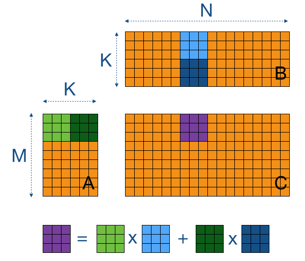
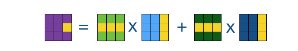

# Guassian Mixture Model

## 优化过程记录：matMul

测试规模：10 x 60000, 60000 x 784

### CPU 版本

```c++
for (int i = 0; i < m; i++) {
    for (int j = 0; j < k; j++) {
        double val = 0.0;
        for (int p = 0; p < n; p++) {
            val += mat1[i*n + p] * mat2[p*k + j];
        }
        buf[i*k + j] = val;
    }
}
```

**运行时间：2.646258s**

### CUDA V1

```c++
__global__ void matMulKernel(const double* mat1, const double* mat2, double* buf, int m, int n, int k) {
    int index = blockIdx.x * blockDim.x + threadIdx.x;

    if (index < m * k)
    {
        int i = index / k;
        int j = index % k;

        double val = 0.0;
        for (int l = 0; l < n; l++)
        {
            val += mat1[i * n + l] * mat2[l * k + j];
        }

        buf[i * k + j] = val;
    }
}
```

**运行时间：0.012765s**

### CUDA V2

使用二位线程块进行分块矩阵乘法，将每个块载入到共享内存中减少访存开销。





```c++
__global__ void matMulKernel(const double* mat1, const double* mat2, double* buf, int m, int n, int k) {
    int i = blockIdx.y * blockDim.y + threadIdx.y;
    int j = blockIdx.x * blockDim.x + threadIdx.x;

    int ty = threadIdx.y;
    int tx = threadIdx.x;

    double val = 0.0;

    __shared__ double matTile1[BLOCK_DIM_2D][BLOCK_DIM_2D];
    __shared__ double matTile2[BLOCK_DIM_2D][BLOCK_DIM_2D];


    int nTiles = (n + BLOCK_DIM_2D - 1) / BLOCK_DIM_2D;

    // 分块乘法
    for (int t = 0; t < nTiles; t++)
    {
        // 载入分块到共享内存
        int x = t * BLOCK_DIM_2D + tx;

        matTile1[ty][tx] = (i < m && x < n) ? mat1[i * n + x] : 0.0;

        int y = t * BLOCK_DIM_2D + ty;

        matTile2[ty][tx] =(y < n && j < k) ? mat2[y * k + j] : 0.0;
        
        __syncthreads();

        // 计算分块乘积
        for (int l = 0; l < BLOCK_DIM_2D; l++)
        {
            val += matTile1[ty][l] * matTile2[l][tx];
        }

        __syncthreads();
    }

    // 写入计算结果
    if (i < m && j < k)
    {
        buf[i * k + j] = val;
    }
}
```

**运行时间：0.006349s**

### CUDA V3

每个线程负责两个位置的载入和计算，从而在计算矩阵乘积时得以复用 `matTile2[l][tx]` 的寄存器数据，减少对共享内存的访问次数。

```c++
__global__ void matMulKernel(const double* mat1, const double* mat2, double* buf, int m, int n, int k) {
    int i = blockIdx.y * blockDim.y * 2 + threadIdx.y;
    int j = blockIdx.x * blockDim.x + threadIdx.x;

    int ty = threadIdx.y;
    int tx = threadIdx.x;

    double val0 = 0.0, val1 = 0.0;

    __shared__ double matTile1[BLOCK_DIM_2D][BLOCK_DIM_2D];
    __shared__ double matTile2[BLOCK_DIM_2D][BLOCK_DIM_2D];

    int nTiles = (n + BLOCK_DIM_2D - 1) / BLOCK_DIM_2D;

    // 分块乘法
    for (int t = 0; t < nTiles; t++)
    {
        // 载入分块到共享内存，一个线程负责两个位置
        int x = t * BLOCK_DIM_2D + tx;

        matTile1[ty][tx] = (i < m && x < n) ? mat1[i * n + x] : 0.0;
        matTile1[ty + BLOCK_DIM_2D / 2][tx] = ((i + BLOCK_DIM_2D / 2) < m && x < n) ? mat1[(i + BLOCK_DIM_2D / 2) * n + x] : 0.0;

        int y = t * BLOCK_DIM_2D + ty;

        matTile2[ty][tx] = (y < n && j < k) ? mat2[y * k + j] : 0.0;
        matTile2[ty + BLOCK_DIM_2D / 2][tx] = ((y + BLOCK_DIM_2D / 2) < n && j < k) ? mat2[(y + BLOCK_DIM_2D / 2) * k + j] : 0.0;

        __syncthreads();

        // 计算分块乘积
        for (int l = 0; l < BLOCK_DIM_2D; l++)
        {
            val0 += matTile1[ty][l] * matTile2[l][tx];
            val1 += matTile1[ty + BLOCK_DIM_2D / 2][l] * matTile2[l][tx];
        }

        __syncthreads();
    }

    // 写入计算结果
    if (i < m && j < k)
    {
        buf[i * k + j] = val0;
        buf[(i + BLOCK_DIM_2D / 2) * k + j] = val1;
    }
}
```

**运行时间：0.005966s**

## 优化过程记录：dataCovariance

这个跟上面的是基本上是一样的

测试规模：60000 x 784

### CPU 版本

```c++
void dataCovariance(const double* xSubMu, double* buf, int m, int dim) {
    double scale = 1.0 / (m - 1);
    for (int i = 0; i < dim; ++i) {
        for (int j = 0; j < dim; ++j) {
            double covar = 0.0;
            for (int k = 0; k < m; ++k) {
                covar += xSubMu[k * dim + i] * xSubMu[k * dim + j];
            }
            buf[i * dim + j] = covar * scale;
        }
    }
}
```

**运行时间：286.136057s**

### CUDA V1

```c++
__global__ void dataCovarianceKernel(const double* xSubMu, double* buf, int m, int dim) {
    int index = blockIdx.x * blockDim.x + threadIdx.x;
    
    if (index < dim * dim) {
        int i = index / dim;
        int j = index % dim;

        double covar = 0.0;
        
        for (int k = 0; k < m; k++)
        {
            covar += xSubMu[k * dim + i] * xSubMu[k * dim + j];
        }

        buf[i * dim + j] = covar  / (double)(m - 1);
    }
}
```

**运行时间：0.242587s**

### CUDA V2

参考矩阵乘法 `matMul` 优化

```c++
__global__ void dataCovarianceKernel(const double* xSubMu, double* buf, int m, int dim) {
    int i = blockIdx.y * blockDim.y + threadIdx.y;
    int j = blockIdx.x * blockDim.x + threadIdx.x;

    int ty = threadIdx.y;
    int tx = threadIdx.x;

    double covar = 0.0;

    __shared__ double tile1[BLOCK_DIM_2D][BLOCK_DIM_2D];
    __shared__ double tile2[BLOCK_DIM_2D][BLOCK_DIM_2D];

    int nTiles = (m + BLOCK_DIM_2D - 1) / BLOCK_DIM_2D;

    // 分块乘法
    for (int t = 0; t < nTiles; t++)
    {
        // 载入分块到共享内存
        int x = t * BLOCK_DIM_2D + tx;

        tile1[ty][tx] = (i < dim && x < m) ? xSubMu[x * dim + i] : 0.0;

        int y = t * BLOCK_DIM_2D + ty;

        tile2[ty][tx] = (y < m && j < dim) ? xSubMu[y * dim + j] : 0.0;
        
        __syncthreads();

        // 计算分块乘积
        for (int k = 0; k < BLOCK_DIM_2D; k++)
        {
            covar += tile1[ty][k] * tile2[k][tx];
        }

        __syncthreads();
    }

    // 写入计算结果
    if (i < dim && j < dim)
    {
        buf[i * dim + j] = covar / (double)(m - 1);
    }
}
```

**运行时间：0.060362s**

### CUDA V3

参考矩阵乘法 `matMul` 优化

```c++
__global__ void dataCovarianceKernel(const double* xSubMu, double* buf, int m, int dim) {
    int i = blockIdx.y * blockDim.y * 2 + threadIdx.y;
    int j = blockIdx.x * blockDim.x + threadIdx.x;

    int ty = threadIdx.y;
    int tx = threadIdx.x;

    double covar0 = 0.0, covar1 = 0.0;

    __shared__ double tile1[BLOCK_DIM_2D][BLOCK_DIM_2D];
    __shared__ double tile2[BLOCK_DIM_2D][BLOCK_DIM_2D];

    int nTiles = (m + BLOCK_DIM_2D - 1) / BLOCK_DIM_2D;

    // 分块乘法
    for (int t = 0; t < nTiles; t++)
    {
        // 载入分块到共享内存，每个线程负责两个元素
        int x = t * BLOCK_DIM_2D + tx;

        tile1[ty][tx] = (i < dim && x < m) ? xSubMu[x * dim + i] : 0.0;
        tile1[ty + BLOCK_DIM_2D / 2][tx] = ((i + BLOCK_DIM_2D / 2) < dim && x < m) ? xSubMu[x * dim + (i + BLOCK_DIM_2D / 2)] : 0.0;

        int y = t * BLOCK_DIM_2D + ty;

        tile2[ty][tx] = (y < m && j < dim) ? xSubMu[y * dim + j] : 0.0;
        tile2[ty + BLOCK_DIM_2D / 2][tx] = ((y + BLOCK_DIM_2D / 2) < m && j < dim) ? xSubMu[(y + BLOCK_DIM_2D / 2) * dim + j] : 0.0;
        
        __syncthreads();

        // 计算分块乘积
        for (int k = 0; k < BLOCK_DIM_2D; k++)
        {
            covar0 += tile1[ty][k] * tile2[k][tx];
            covar1 += tile1[ty + BLOCK_DIM_2D / 2][k] * tile2[k][tx];
        }

        __syncthreads();
    }

    // 写入计算结果
    if (i < dim && j < dim)
    {
        buf[i * dim + j] = covar0 / (double)(m - 1);
        buf[(i + BLOCK_DIM_2D / 2) * dim + j] = covar1 / (double)(m - 1);
    }
}
```

**运行时间：0.047226s**

## 优化过程记录：dataAverageCovariance

测试规模：60000 x 784

### CPU 版本：

```c++
void dataAverageCovariance(const double* xSubMu, const double* weights, double* buf, int m, int dim) {
    double scale = 0.0;
    for (int k = 0; k < m; ++k) {
        scale += weights[k];
    }
    scale = 1.0 / (scale + 10 * __DBL_EPSILON__);
    for (int i = 0; i < dim; ++i) {
        for (int j = 0; j < dim; ++j) {
            double covar = 0.0;
            for (int k = 0; k < m; ++k) {
                covar += weights[k] * xSubMu[k * dim + i] * xSubMu[k * dim + j];
            }
            buf[i * dim + j] = covar * scale;
        }
    }
}
```

**运行时间：295.033056s**

### CUDA V1

使用一维线程块，每个线程负责计算输出矩阵的一个元素

```c++
__global__ void dataAverageCovarianceKernel(const double* xSubMu, const double* weights, double* buf, int m, int dim) {
    int index = blockIdx.x * blockDim.x + threadIdx.x;
    
    if (index < dim * dim) {
        int i = index / dim;
        int j = index % dim;

        double scale = 0.0;
        double covar = 0.0;
        
        for (int k = 0; k < m; k++)
        {
            scale += weights[k];
            covar += weights[k] * xSubMu[k * dim + i] * xSubMu[k * dim + j];
        }

        buf[i * dim + j] = covar  / (scale + 10 * __DBL_EPSILON__);
    }
}
```

**运行时间：0.223474s**

### CUDA V2

参考矩阵乘法 `matMul` 优化

```c++
__global__ void dataAverageCovarianceKernel(const double* xSubMu, const double* weights, double* buf, int m, int dim) {
    int i = blockIdx.y * blockDim.y + threadIdx.y;
    int j = blockIdx.x * blockDim.x + threadIdx.x;

    int ty = threadIdx.y;
    int tx = threadIdx.x;

    double covar = 0.0;
    double scale = 0.0;

    __shared__ double tile1[BLOCK_DIM_2D][BLOCK_DIM_2D];
    __shared__ double tile2[BLOCK_DIM_2D][BLOCK_DIM_2D];

    int nTiles = (m + BLOCK_DIM_2D - 1) / BLOCK_DIM_2D;

    // 分块乘法
    for (int t = 0; t < nTiles; t++)
    {
        // 载入分块到共享内存
        int x = t * BLOCK_DIM_2D + tx;

        tile1[ty][tx] = (i < dim && x < m) ? xSubMu[x * dim + i] : 0.0;
    
        int y = t * BLOCK_DIM_2D + ty;

        tile2[ty][tx] = (y < m && j < dim) ? xSubMu[y * dim + j] : 0.0;
        
        __syncthreads();

        // 计算分块乘积
        for (int k = 0; k < BLOCK_DIM_2D; k++)
        {
            int kAbs = t * BLOCK_DIM_2D + k;
            if (kAbs < m)
            {
                scale += weights[kAbs];
                covar += weights[kAbs] * tile1[ty][k] * tile2[k][tx];
            }
        }

        __syncthreads();
    }

    // 写入计算结果
    if (i < dim && j < dim)
    {
        buf[i * dim + j] = covar / (scale + 10 * __DBL_EPSILON__);
    }
}
```

**运行时间：0.088237s**

### CUDA V3

参考矩阵乘法 `matMul` 优化

```c++
__global__ void dataAverageCovarianceKernel(const double* xSubMu, const double* weights, double* buf, int m, int dim) {
    int i = blockIdx.y * blockDim.y * 2 + threadIdx.y;
    int j = blockIdx.x * blockDim.x + threadIdx.x;

    int ty = threadIdx.y;
    int tx = threadIdx.x;

    double covar0 = 0.0, covar1 = 0.0;
    double scale = 0.0;

    __shared__ double tile1[BLOCK_DIM_2D][BLOCK_DIM_2D];
    __shared__ double tile2[BLOCK_DIM_2D][BLOCK_DIM_2D];

    int nTiles = (m + BLOCK_DIM_2D - 1) / BLOCK_DIM_2D;

    // 分块乘法
    for (int t = 0; t < nTiles; t++)
    {
        // 载入分块到共享内存
        int x = t * BLOCK_DIM_2D + tx;

        tile1[ty][tx] = (i < dim && x < m) ? xSubMu[x * dim + i] : 0.0;
        tile1[ty + BLOCK_DIM_2D / 2][tx] = ((i + BLOCK_DIM_2D / 2) < dim && x < m) ? xSubMu[x * dim + (i + BLOCK_DIM_2D / 2)] : 0.0;
    
        int y = t * BLOCK_DIM_2D + ty;

        tile2[ty][tx] = (y < m && j < dim) ? xSubMu[y * dim + j] : 0.0;
        tile2[ty + BLOCK_DIM_2D / 2][tx] = ((y + BLOCK_DIM_2D / 2) < m && j < dim) ? xSubMu[(y + BLOCK_DIM_2D / 2) * dim + j] : 0.0;
        
        __syncthreads();

        // 计算分块乘积
        for (int k = 0; k < BLOCK_DIM_2D; k++)
        {
            int kAbs = t * BLOCK_DIM_2D + k;
            if (kAbs < m)
            {
                scale += weights[kAbs];
                covar0 += weights[kAbs] * tile1[ty][k] * tile2[k][tx];
                covar1 += weights[kAbs] * tile1[ty + BLOCK_DIM_2D / 2][k] * tile2[k][tx];
            }
        }

        __syncthreads();
    }

    // 写入计算结果
    if (i < dim && j < dim)
    {
        buf[i * dim + j] = covar0 / (scale + 10 * __DBL_EPSILON__);
        buf[(i + BLOCK_DIM_2D / 2) * dim + j] = covar1 / (scale + 10 * __DBL_EPSILON__);
    }
}
```

**运行时间：0.068431s**

## 优化过程记录：matCholesky

原理参考：[矩阵的 Cholesky 分解](https://blog.csdn.net/baimafujinji/article/details/6512460)

在 MNIST 数据集中的实际规模是 784 x 784，为了凸显区别，这里使用 4096 x 4096 进行测试。

### CPU 版本

```c++
void matCholesky(const double* mat, double* buf, int m){
    for(int k = 0; k < m; k++) {
        double sum = 0.0;

        for(int i = 0; i < k; i++) {
            sum += buf[k * m + i] * buf[k * m + i];
        }
        buf[k * m + k] = sqrt(mat[k * m + k] - sum);
        
        for(int i = k + 1; i < m; i++) {
            sum = 0.0;
            for(int j = 0; j < k; j++) {
                sum += buf[i * m + j] * buf[k * m + j];
            }

            buf[i * m + k] = (mat[i * m + k] - sum) / buf[k * m + k];
        }
        
        for(int j = 0; j < k; j++) {
            buf[j * m + k] = 0;
        }
    }
}
```

**运行时间：14.647272s**

### CUDA V1

Cholesky 分解的算法中，最外层的逐列计算循环之间存在数据依赖。另外，计算每一列对角线下方元素时，该列对角线上的元素需要已经算好。

考虑到 CUDA 核函数中没有全局同步的机制，我使用了两个核函数分别计算对角线上的元素和对角线下的元素，然后在 CPU 上使用 `for` 循环逐列调用核函数计算。

核函数：

```c++
__global__ void matCholeskyDiagKernel(const double* mat, double* buf, int m, int k) {
    // 这个核函数只能使用 1 个线程！！
    double sum = 0.0;
    for (int i = 0; i < k; i++)
    {
        sum += buf[k * m +i] * buf[k * m + i];
    }
    
    buf[k * m + k] = sqrt(mat[k * m + k] - sum);
}

__global__ void matCholeskyColumnKernel(const double* mat, double* buf, int m, int k) {
    int i = blockIdx.x * blockDim.x + threadIdx.x;

    if (i < k)
    {
        buf[i * m + k] = 0.0;
    }
    else if (k < i && i < m)
    {  
        double sum = 0.0;
        for (int j = 0; j < k; j++)
        {
            sum += buf[i * m + j] * buf[k * m + j];
        }

        buf[i * m + k] = (mat[i * m + k] - sum) / buf[k * m + k];
    }
}
```

CPU 代码：

```c++
int numBlocks = (m + BLOCK_DIM_1D - 1) / BLOCK_DIM_1D;

for (int k = 0; k < m; k++)
{
    matCholeskyDiagKernel<<<1, 1>>>(mat, buf, m, k);
    matCholeskyColumnKernel<<<numBlocks, BLOCK_DIM_1D>>>(mat, buf, m, k);
}
```

**运行时间：1.819354s**

### CUDA V2

上面的核函数 `matCholeskyColumnKernel` 中存在一个 `for` 循环，在该 `for` 循环中同一个 warp 中的线程会访问矩阵不同行的（同一列）数据，访存事务无法合并，只能串行访存。然而，CUDA 的不同线程块间是可以并行访存的（通过调度掩盖延迟），如果我们将线程分散到不同的线程块中，串行访存带来的开销将能够被有效减小。

修改 CPU 代码为：

```c++
for (int k = 0; k < m; k++)
{
    matCholeskyDiagKernel<<<1, 1>>>(mat, buf, m, k);
    matCholeskyColumnKernel<<<m, 1>>>(mat, buf, m, k);
}
```

**运行时间：1.059844s**

## 优化过程记录：solveLower

测试规模：784 x 784, 60000 x 784

### CPU 版本

```c++
void solveLower(const double* lower, const double* b, double* buf, int dim, int n) {
    for (int k = 0; k < n; ++k)
    {
        for (int i = 0; i < dim; ++i)
        {
            double val = b[k * dim + i];
            for (int j = 0; j < i; ++j)
            {
                val -= (lower[i * dim + j] * buf[k * dim + j]);
            }
            buf[k * dim + i] = val / lower[i * dim + i];
        }
    }
}
```

**运行时间：20.320882s**

### CUDA V1

每个线程计算一个向量

```c++
__global__ void solveLowerKernel(const double* lower, const double* b, double* buf, int dim, int n) {
    int k = blockIdx.x * blockDim.x + threadIdx.x;

    if (k < n)
    {
        for (int i = 0; i < dim; i++)
        {
            double val = b[k * dim + i];
            for (int j = 0; j < i; j++)
            {
                val -= lower[i * dim + j] * buf[k * dim + j];
            }

            buf[k * dim + i] = val / lower[i * dim + i];
        }
    }
}
```

**运行时间：0.831100s**

因为输出 buf 还要不断读进来，本来想用共享内存优化一下，但仔细一想共享内存只有 48kB，一个 784 维的双精度向量就是 6.125kB 了，可能不太行？有空的话可以试一下。
